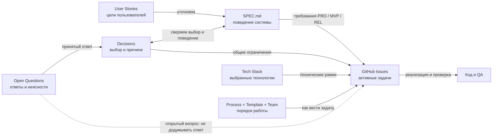

# Карта документов

Здесь показано, откуда берутся требования и как они превращаются в задачи. Стрелки обозначают рабочий поток, а не то, что один документ автоматически важнее другого.

## Поток

## Где что искать

| Документ | Назначение | Когда открывать |
| --- | --- | --- |
| [User Stories](user-stories.md) | Коротко: кто чего хочет и зачем. | Чтобы понять цель требования. |
| [SPEC.md](../SPEC.md) | Подробное поведение, роли, потоки и требования с ID. | Читать связанные с задачей разделы и ID, а не весь файл. |
| [Decisions](decisions.md) | Принятые общие выборы и причины. | Перед грумингом, реализацией и проверкой задачи. |
| [Open Questions](open-questions.md) | Исходные вопросы, принятые ответы и то, что ещё не решено. | Когда задача затрагивает неясное поведение или следующий этап. |
| [Tech Stack](tech-stack.md) | Утверждённые инструменты Prototype. | При выборе зависимости, среды или способа развёртывания. |
| [Process](process.md), [Task Template](task-template.md), [Team](team/pm.md) | Порядок работы с Issue, его формат и роли PM, Engineer, QA. | При подготовке и выполнении Issue. |
| [GitHub Issues](https://github.com/tryproxy/tg-super-backend/issues) | Активный список задач, их критерии и зависимости. | Чтобы выбрать конкретную работу и проверить её результат. |
| [Архив](archived/) | Предыдущие план, концепт, спецификация, архитектура и черновик задач. | Только для истории или недостающего контекста; архив может расходиться с текущими решениями. |

## Как пройти одну задачу

1. Открыть Issue и связанную User Story. Быстро сверить общие правила в Decisions.
2. Найти соответствующие ID и разделы в SPEC.md. Если затронут нерешённый вопрос, открыть Open Questions и сначала получить решение.
3. При груминге уточнить критерии Issue и сослаться на требования Spec. При реализации и проверке использовать Issue вместе с этими требованиями; Tech Stack читать, когда затронут технический выбор.

Spec отвечает на вопрос «что должна делать система», Decisions — «почему выбран этот вариант», а Issue — «какую часть делаем сейчас». Если они расходятся, нельзя молча выбрать один документ по старшинству: нужно установить принятое решение и согласовать формулировки до реализации.

Текущая `architecture.md` пока [в архиве](archived/architecture.md) и не задаёт действующие требования. После её обновления она сможет отдельно объяснять связи компонентов; таблица технологий останется в Tech Stack.
