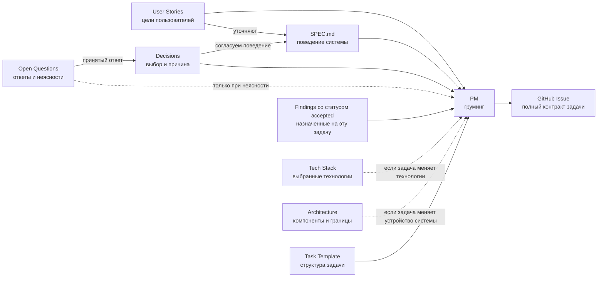
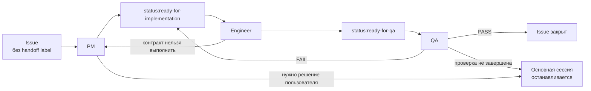

# Карта документов

Здесь показано, откуда берутся требования, как они превращаются в задачи и какие документы читает каждая роль. Стрелки обозначают рабочий поток, а не старшинство документов.

## Поток требований



## Жизненный цикл Issue



## Точки входа ролей

```text
Основная сессия
  AGENTS → Process → Routing → выбранный профиль
                     │
                     └─ выбор профиля и разрешение на дорогой маршрут
  Передаёт конкретное задание и нужный отчёт, без всей истории обсуждения.

Все роли
  Применяют AGENTS.
  Читают его отдельно, только если он ещё не был предоставлен.

PM
  профиль → team/pm.md → Issue + User Story + связанные SPEC ID
                       → Routing: только классификация PM
                       → Task Template
                       │
                       ├─ существующий Issue → связанные Findings
                       ├─ новый Issue → реестр Findings по его области
                       ├─ работа с Findings → Research workflow
                       └─ выбор или конфликт → Decisions
                                               └─ нет ответа → Open Questions

Engineer
  профиль → team/engineer.md → Issue + связанные SPEC ID
                             ├─ повторная попытка → отчёт QA
                             ├─ добавление зависимости → Tech Stack
                             └─ проверки → package.json
                                           + README при необходимости

QA
  профиль → team/qa.md → Issue + отчёт Engineer
                       → код и проверки критериев Issue
                       → команды и настройка окружения при необходимости
                       │
                       ├─ всё проверено и соответствует → PASS
                       ├─ подтверждено нарушение критерия → FAIL
                       └─ проверка не завершена, нарушение не установлено
                          → отчёт без вердикта → остановка основной сессии
```

## Где что искать

| Документ | Назначение | Когда открывать |
| --- | --- | --- |
| [User Stories](user-stories.md) | Коротко: кто чего хочет и зачем. | Чтобы понять цель требования. |
| [SPEC.md](../SPEC.md) | Подробное поведение, роли, потоки и требования с ID. | Читать связанные с задачей разделы и ID, а не весь файл. |
| [Decisions](decisions.md) | Принятые общие выборы и причины. | Когда нужно понять выбор или устранить расхождение. |
| [Open Questions](open-questions.md) | Исходные вопросы, принятые ответы и то, что ещё не решено. | Когда задача затрагивает неясное поведение или следующий этап. |
| [Tech Stack](tech-stack.md) | Утверждённые инструменты Prototype. | При выборе зависимости, среды или способа развёртывания. |
| [Architecture](architecture.md) | Компоненты, обмен сообщениями и границы этапов. | Когда нужно понять, как устроен поток и где разместить изменение. |
| [Routing](routing.md) | Определения routing labels и выбор профилей Engineer и QA. | PM использует при классификации, основная сессия — при делегировании. |
| [Process](process.md), [Task Template](task-template.md), [PM](team/pm.md), [Engineer](team/engineer.md), [QA](team/qa.md) | Порядок работы с Issue, его формат и роли PM, Engineer, QA. | При подготовке и выполнении Issue. |
| [Research workflow](research/README.md), [Findings](research/findings.md) | Правила работы с поздно найденными улучшениями, ограничениями и рисками; реестр показывает их место в очереди. | При груминге PM читает связанные с Issue записи; при создании Issue проверяет реестр для его области. |
| [GitHub Issues](https://github.com/tryproxy/tg-super-backend/issues) | Активный список задач, их критерии и зависимости. | Чтобы выбрать конкретную работу и проверить её результат. |
| [Архив](archived/) | Предыдущие план, концепт, спецификация, архитектура и черновик задач. | Только для истории или недостающего контекста; архив может расходиться с текущими решениями. |

Порядок выполнения Issue и остановки определены в [Process](process.md#lifecycle). Основная сессия читает Process; каждая роль — свою инструкцию. Engineer использует Issue и указанный в нём контекст; QA проверяет критерии Issue.

Spec отвечает на вопрос «что должна делать система», Decisions — «почему выбран этот вариант», а Issue — «какую часть делаем сейчас». Если они расходятся, нельзя молча выбрать один документ по старшинству: нужно установить принятое решение и согласовать формулировки до реализации.

Действующая [Architecture](architecture.md) объясняет связи компонентов. [Устаревшая версия](archived/architecture-outdated.md) остаётся в архиве для истории; таблица технологий находится в Tech Stack.
