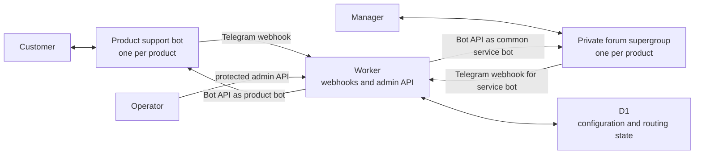
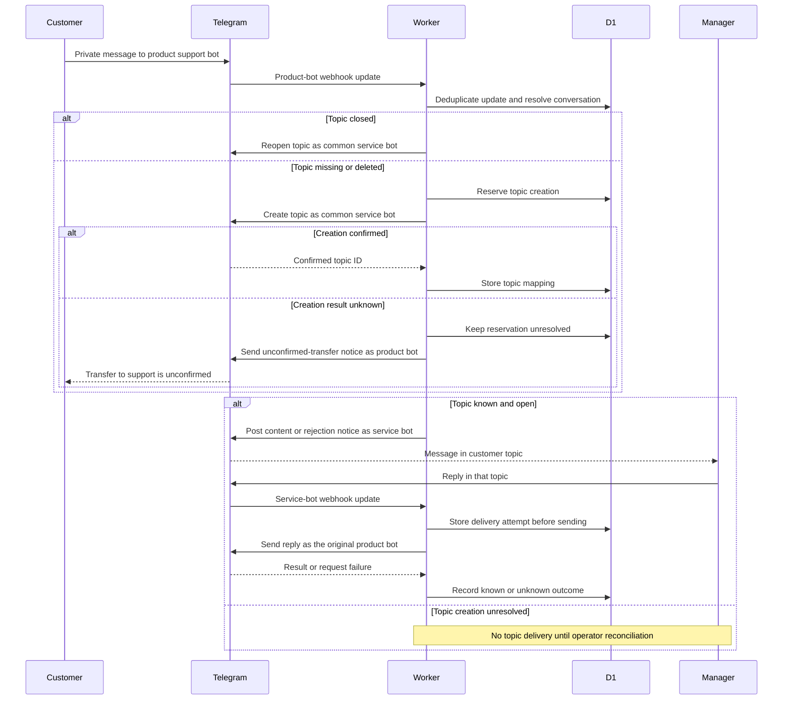

# Architecture

Status: active design for the Prototype. MVP and Release coverage here is limited to the boundaries already accepted for those stages. [SPEC.md](SPEC.md) defines behavior and requirement IDs; [decisions.md](decisions.md) records choices and reasons; [tech-stack.md](tech-stack.md) is the list of selected technologies.

## Components

The Prototype runs the Telegram webhooks and protected administrative API in one Cloudflare Worker. D1 holds integration settings and routing state. Telegram carries messages between customers, bots, and product support supergroups. No continuously running application server or Shell interface is needed for the Prototype.

Webhook and Bot API arrows pass through Telegram. The product support bot and the common service bot are distinct Telegram identities; the diagram shows their roles, not separate backend processes.

| Component | Responsibility |
| --- | --- |
| Product support bot | Customer-facing identity dedicated to one product; receives private customer messages and sends that product's replies. |
| Common service bot | One platform bot in every product group; receives manager messages and creates or manages customer topics. |
| Worker | Resolves integrations and conversations, validates incoming updates, routes content, and exposes protected setup and operational APIs. |
| D1 | Persists product/channel/group references, conversation and topic mappings, processed update IDs, topic-creation state, and delivery attempts. |
| Support supergroup | One active private forum group per product; managers work in its customer topics. Group and manager membership are prepared manually in the Prototype. |

## Message path

The conversation key is **product ID + customer channel ID + external chat ID**. The reverse route uses the configured group and topic ID. A later customer message uses the current topic; a closed topic is reopened, while a deleted topic is replaced. A first unsupported or oversized customer message still creates a topic and leaves an explanatory notice there. For supported media, the Worker downloads through the receiving bot and uploads through the sending bot: Telegram's [`file_id` is specific to one bot](https://core.telegram.org/bots/api#sending-files).

## Reliability and operational state

- D1 uniqueness and a per-conversation creation reservation prevent concurrent webhook updates from starting multiple topic-creation calls. Processed update IDs include the receiving bot and are retained for seven days. Conversation-to-topic mappings remain until their integration is deleted.
- Telegram and D1 cannot confirm one shared transaction. If topic creation may have succeeded but its result is unknown, the reservation stays unresolved and the Worker does not create another topic automatically. The product bot tells the customer that transfer to support is unconfirmed. A protected operational API lets an operator inspect the unresolved conversation without message contents or secrets, link a verified topic, or authorize another attempt after checking Telegram.
- An ordinary message from a non-bot member who can write in a mapped topic is an immediate external reply. The Worker stores an in-progress delivery attempt before the Bot API call. A confirmed failure or unknown outcome is shown in the topic. Unknown outcomes are not retried automatically; a manager's explicit new message is a separate attempt. Delivery statuses are retained for 30 days.
- Readiness checks report configuration and bot/group access. They do not present delivery history as setup status. The operational review of uncertain topic creation is a separate API surface.

The Prototype uses the Worker, D1, and Telegram Bot API directly. Queues and Durable Objects are not part of the accepted stack; add them only if a later requirement or measured limitation justifies them.

## Access and environments

The administrative API is protected. Its service credential and the key used to encrypt registered product-bot tokens are Worker secrets; D1 stores the bot tokens encrypted rather than in plaintext. Telegram webhooks check the configured secret token and receiving bot identity. Administrative reads and logs do not expose credentials or customer message contents. [Cloudflare Worker secrets](https://developers.cloudflare.com/workers/configuration/secrets/) provide the runtime secret binding; D1 is accessed through its Worker binding.

Test and demo use separate product support bots, common service bots, groups, webhook endpoints, and D1 databases. Local development uses the test resources. Production resources are outside the Prototype. The current cost choices are in [tech-stack.md](tech-stack.md); usage limits should be checked against provider documentation before deployment rather than copied into this document.

## Later-stage boundaries

| Stage | Architectural change |
| --- | --- |
| MVP | Shell configures integrations through the backend API. A shared Business connector bot adds another customer-channel type. A product may use an ordinary support bot, Business, or both; the channel ID keeps their conversations and topics separate. CSV onboarding and manager join requests use the existing product group. The Business rights, CSV format, and Shell ownership questions remain in [open-questions.md](open-questions.md). |
| Release | For a product without a group, Shell obtains owner authorization through QR and a separate MTProto component creates the group under that account. It records and reconciles provisioning state. After the new group is ready, the same authorized session can attempt to add resolvable, confirmed managers from a CSV; outcomes are tracked per row. Existing groups and unsuccessful direct invitations use the MVP invitation-link path. Provisioning and invitations stay outside the normal webhook message path. Session storage, QR fallback, and direct-invite identities remain open questions. |
