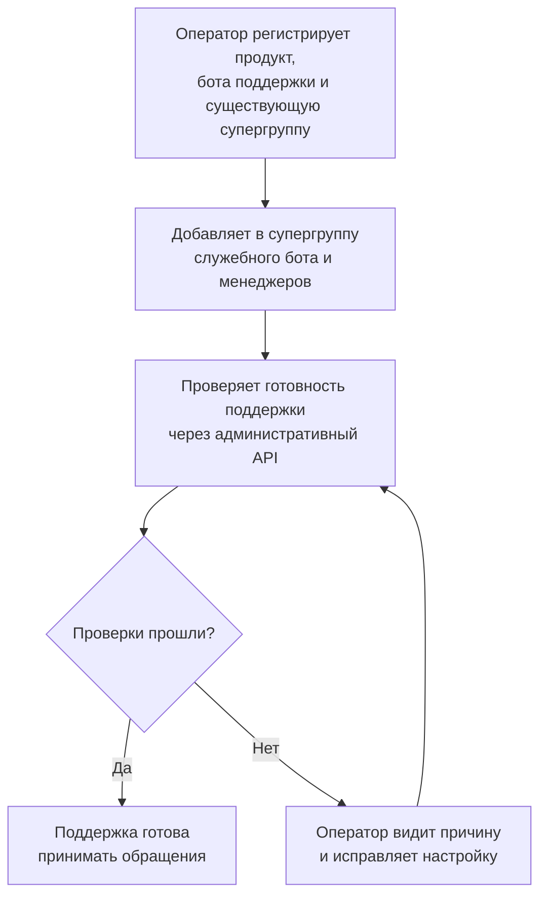
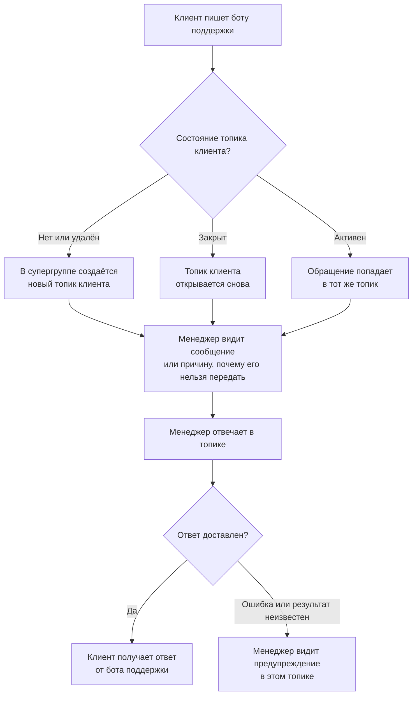
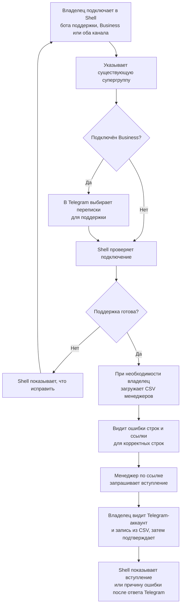
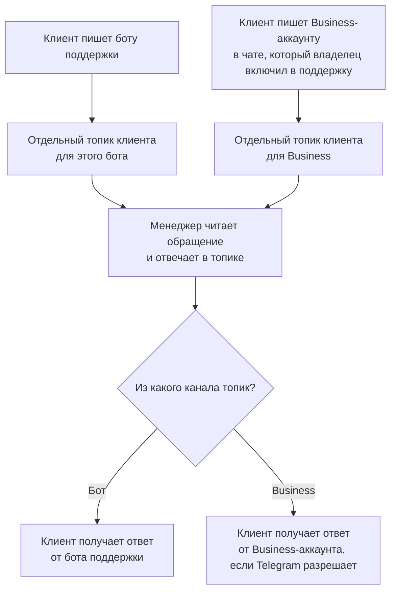
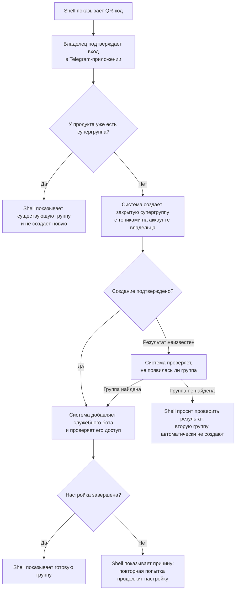

# User Stories

## Что делаем

Клиент пишет в Telegram-поддержку продукта — боту или подключённому Business-аккаунту. Команда поддержки (менеджеры) видит диалог в отдельном топике с именем клиента в супергруппе и отвечает из этого топика.

## Для кого и зачем

- Клиенту — писать в привычный Telegram-чат поддержки конкретного продукта.
- Менеджеру — видеть обращения клиентов и отвечать на них в одной супергруппе.
- Оператору и владельцу продукта — подключать Telegram-поддержку и понимать, что нужно исправить, если она не работает.

## Этапы

После Prototype следует MVP, а после MVP — Release.

## Prototype

### US-01 — Регистрация поддержки продукта

Как оператор, я могу зарегистрировать несколько продуктов через защищённый административный API и настроить для каждого из них отдельного Telegram-бота поддержки и существующую супергруппу с включёнными топиками.

Критерии приёмки: конфигурация проверяется до активации; одна супергруппа не может быть подключена сразу к двум продуктам; при просмотре настроек через API токены ботов и другие секреты не возвращаются.

### US-02 — Подготовка супергруппы поддержки

Как оператор, я могу вручную добавить общего служебного бота и менеджеров в супергруппу продукта, чтобы команда могла работать в ней.

Критерии приёмки: у служебного бота есть права, необходимые для чтения сообщений и создания топиков супергруппы; при отсутствии прав статус настройки содержит понятное указание, что нужно исправить.

### US-03 — Начало и продолжение диалога

Как клиент, я могу писать Telegram-боту поддержки, а менеджеры видят мои обращения в одном и том же топике супергруппы.

Критерии приёмки: первое сообщение создаёт топик, а следующие попадают в тот же топик; если топик удалили, система создаёт новый. Сообщения не попадают в другой продукт и не дублируются, если Telegram повторно отправляет обновление в течение семи дней.

### US-04 — Обмен сообщениями и файлами

Как клиент или менеджер, я могу через наш бэкенд обмениваться текстовыми сообщениями, фотографиями, документами и голосовыми сообщениями.

Критерии приёмки: подписи к фотографиям и документам сохраняются. Если сообщение нельзя передать из-за формата или размера, отправитель получает уведомление, а причина появляется в топике клиента.

### US-05 — Ответ из топика супергруппы

Как менеджер, я могу ответить клиенту прямо в его топике супергруппы, и ответ сразу приходит клиенту от Telegram-бота поддержки.

Критерии приёмки: клиенту отправляются только сообщения менеджера из его топика супергруппы. Ошибка или неизвестный результат доставки отображаются в этом же топике.

### US-06 — Проверка настройки интеграции через административный API

Как оператор, я могу через административный API проверить, готова ли Telegram-интеграция продукта к работе.

Критерии приёмки: API показывает результат каждой проверки и понятную причину ошибки. Токены, другие секреты и сообщения клиентов в ответ не попадают.

### Как оператор готовит поддержку в Prototype

### Как клиент и менеджер общаются в Prototype

## MVP

### US-07 — Подключение аккаунта Telegram Business

Как владелец продукта, я могу подключить свой Telegram Business-аккаунт к поддержке, чтобы менеджеры отвечали клиентам из супергруппы от имени моего аккаунта.

Критерии приёмки: владелец выбирает в Telegram, какие переписки передать в поддержку, и только сообщения из этих переписок появляются в супергруппе. Ответ менеджера из топика приходит клиенту от имени подключённого Telegram Business-аккаунта.

### US-08 — Настройка поддержки в Shell

Как владелец продукта, я могу в Shell подключить Telegram-бота поддержки или Telegram Business-аккаунт и проверить, работает ли поддержка.

Критерии приёмки: в Shell я могу указать уже созданную супергруппу. Если подключение не работает, Shell показывает, что нужно исправить.

### US-09 — Импорт менеджеров из CSV

Как владелец продукта, я могу загрузить CSV со списком менеджеров, чтобы система подготовила для них приглашения в супергруппу.

Критерии приёмки: для корректных строк подготовлены ссылки-приглашения. Ошибки в остальных строках видны мне.

### US-10 — Подтверждение вступления менеджеров

Как владелец продукта, я могу подтвердить вступление приглашённого менеджера в супергруппу.

Критерии приёмки: перед подтверждением я вижу Telegram-аккаунт заявителя и запись менеджера из CSV. После ответа Telegram Shell показывает, вступил ли менеджер; при ошибке показывает причину и не отмечает его как вступившего.

### Как владелец настраивает поддержку и подтверждает менеджеров в MVP

### Как клиент и менеджер общаются в MVP

## Release

### US-11 — Автоматическое создание супергруппы поддержки

Как владелец продукта, я могу подключить свой Telegram-аккаунт через QR-код в Shell, чтобы система создала супергруппу поддержки для моего продукта.

Критерии приёмки: после подтверждения входа в Telegram-приложении система создаёт супергруппу с топиками и добавляет служебного бота. Если к продукту уже подключена группа, ещё одну не создаёт.

### Как владелец создаёт супергруппу в Release

Дополнительные возможности, включая отдельные тикеты, редактирование сообщений, альбомы и внутренние заметки в клиентских топиках супергруппы, пока не включены в утверждённый объём работ.
