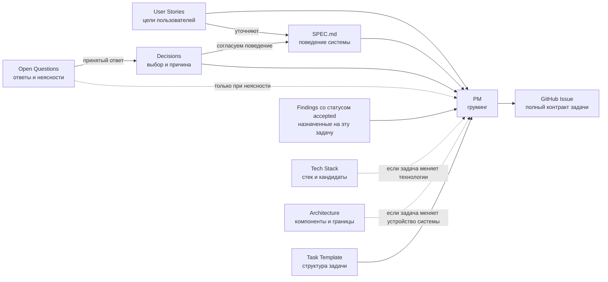
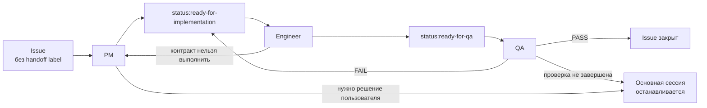

# Карта рабочего процесса

Здесь показано, откуда берутся требования, как они превращаются в задачи и какие документы читает каждая роль. Стрелки обозначают рабочий поток, а не старшинство документов.

## Поток требований



Если документы расходятся, нужно выяснить принятое решение и согласовать формулировки до реализации.

## Жизненный цикл Issue



Схема показывает основные переходы. Точный порядок выполнения Issue и условия остановки описаны в [Process](process.md#lifecycle).

## Точки входа ролей

Схема ниже показывает, с чего начинает основная сессия и какие документы нужны каждой роли. Ветки с условиями открываются только когда они относятся к текущему Issue: так PM, Engineer и QA получают нужный контекст без чтения всей документации.

```text
Основная сессия
  AGENTS → Process → Routing → выбранный профиль
                     │
                     └─ выбор профиля и разрешение на дорогой маршрут
  Передаёт конкретное задание и нужный отчёт, без всей истории обсуждения.

Все роли
  Применяют AGENTS.
  Читают его отдельно, только если он ещё не был предоставлен.

PM
  профиль → team/pm.md → Issue + User Story + связанные SPEC ID
                       → Routing: только классификация PM
                       → Task Template
                       │
                       ├─ существующий Issue → связанные Findings
                       ├─ новый Issue → реестр Findings по его области
                       ├─ работа с Findings → Research workflow
                       └─ выбор или конфликт → Decisions
                                               └─ нет ответа → Open Questions

Engineer
  профиль → team/engineer.md → Issue + связанные SPEC ID
                             ├─ повторная попытка → отчёт QA
                             ├─ добавление зависимости → Tech Stack
                             └─ проверки → package.json
                                           + README при необходимости

QA
  профиль → team/qa.md → Issue + отчёт Engineer
                       → код и проверки критериев Issue
                       → команды и настройка окружения при необходимости
                       │
                       ├─ всё проверено и соответствует → PASS
                       ├─ подтверждено нарушение критерия → FAIL
                       └─ проверка не завершена, нарушение не установлено
                          → отчёт без вердикта → остановка основной сессии
```

